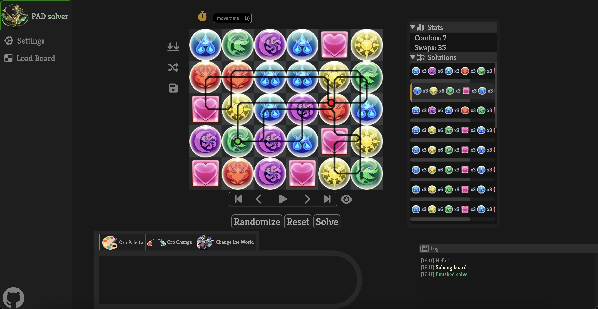

# PAD Solver
A Puzzles & Dragons simulator and solver. 

## Features

### Board Simulation  

Combo as you would in game. In order to begin comboing, the board must not have empty orb slots. There also exists toggles for skyfalls and a movement timer.

> [!TIP]
> Use in conjunction with the path overlay to practice solutions!

### Board Solve

Use the solve button to generate a list of paths in the solutions window. Currently, the solutions prioritize combo count > path length. Select paths in the solutions window to view their stats and to display the path overlay on the board. The start and end point of the paths are indicated by the green and red dots respectively.

### Save/Load Boards

If you have any specific boards you want to revisit or practice, this is an easy way to do so! Note that you can also upload screenshots (ideally taken from inside the game) to load a board.

### Board Editing

There is a toolbar at the located towards the bottom of the page that allows for intuitive board editing. Paint orbs onto the board with the orb palette, convert orbs from one type to another, or just simply shuffle orbs without triggering combos.

## Related

Here are two other great PAD-based web applications.

- [dawnglare](https://pad.dawnglare.com/) - I personally have used this in the past and is excellent for a general-purpose board simulator.
- [padopt](https://padopt.macboy.me/) - A board optimizer with support for 7x6 and many other features.

This project draws inspiration from both these applications so nothing but thanks!

