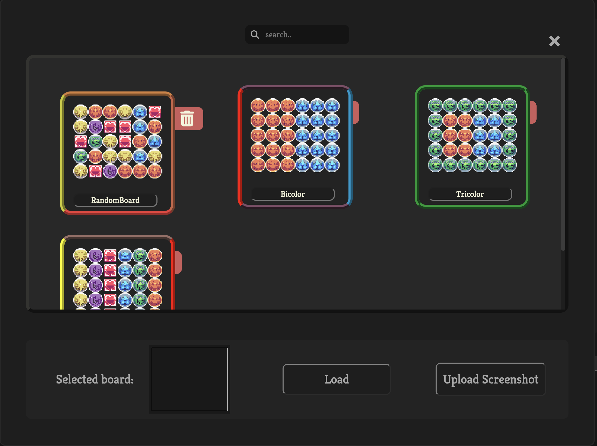
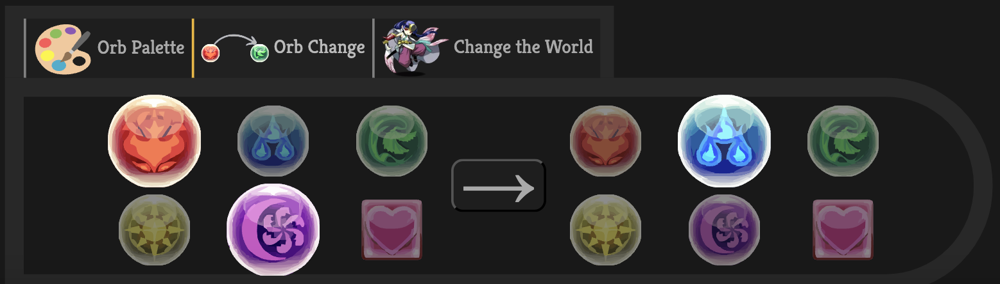

# PAD Solver
A Puzzles & Dragons simulator and solver. 

## Features

### Board Simulation  

Combo as you would in game. There are toggles beside the board to customize various board settings like skyfalls. 

### Board Solve

Use the solve button to generate a list of paths in the solutions window. Currently, the solutions prioritize combo count > path length. Select paths in the solutions window to view their stats and to display the path overlay on the board. The start and end point of the paths are indicated by the green and red dots respectively. Combo with the path overlay to practice solutions!

### Save/Load Boards

Save and load boards for future use! This is useful if you want to practice on specific boards or common configurations.

> [!TIP]
> You can also upload screenshots (ideally taken from inside the game) to load a board.

### Board Editing

Use the toolbar for intuitive board editing. 

- `Orb Palette` - Paint orbs onto the board by selecting an orb type and dragging across the board.
- `Orb Convert` - Change orb types by toggling the appropriate orb types for the before and after.
- `Change the World` - Allows shuffling of orbs without triggering combos.

## Related

Here are two other great PAD-based web applications.

- [dawnglare](https://pad.dawnglare.com/) - I personally have used this in the past and is excellent for a general-purpose board simulator.
- [padopt](https://padopt.macboy.me/) - A board optimizer with support for 7x6 and many other features.

This project draws inspiration from both these applications so nothing but thanks!

